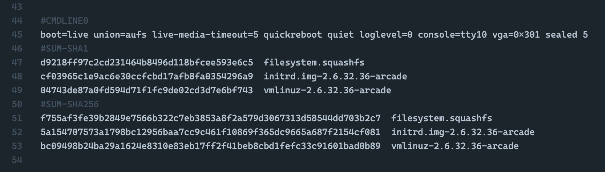
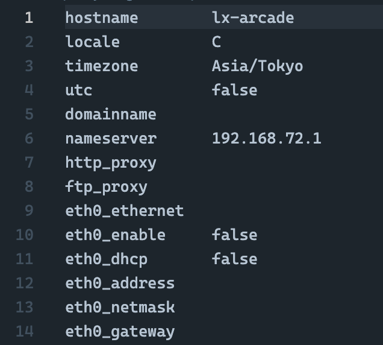
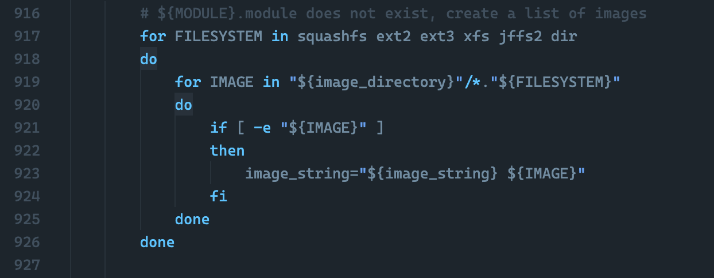
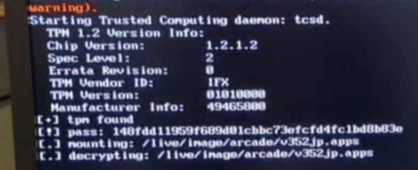
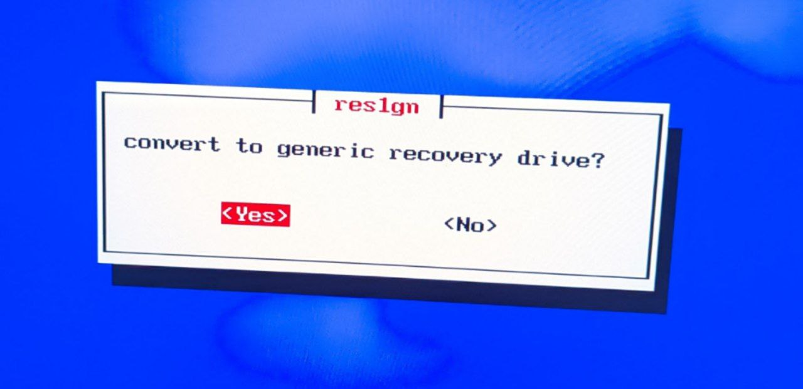
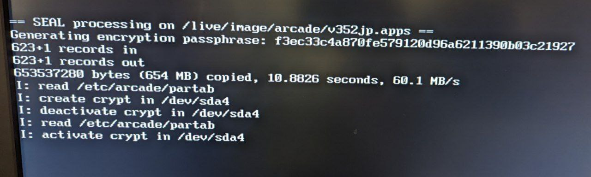

rES1gn
======

A dead-simple Namco System ES1 pure software exploit. No hardware required!

Overview
--------

The [Namco System ES1](https://ja.wikipedia.org/wiki/SYSTEM_ES1) is a Linux PC-based arcade board released by Namco in 2009.
For more details on its workings and security architecture, I heartily recommend
[this excellent writeup](https://medium.com/@ValdikSS/researching-protection-and-recovering-namco-system-es1-arcades-1f8423fdeb3b)
by [@ValdikSS](https://twitter.com/ValdikSS), as well as
[my own notes](https://github.com/Shizmob/arcade-docs/blob/main/namco/boards.md#system-es1).

To protect its game contents, the System ES1 uses
[TPM sealing](https://en.wikipedia.org/wiki/Trusted_Computing#SEALED-STORAGE): briefly explained,
a random key is generated the first time it boots (possibly in-factory), which is then used to encrypt the game.
The key is then stored inside the System ES1's TPM 1.2-compatible trust module, and *bound* to the current
hardware and software state using the TPM's own
[Platform Configuration Registers (PCR)](https://link.springer.com/chapter/10.1007/978-1-4302-6584-9_12).
These are registers that can only be appended to, where `new-value = HASH(current-value || input)`.
The first 16 of these registers, PCR0-PCR15, are reserved for the core and static root of trust (CRTM and SRTM),
and each is given a specific purpose. On subsequent boots, the TPM will *only* allow the key to be read if the
values of its PCRs match the values the key was bound to.

The boot chain
--------------

When the system boots, the BIOS boot block is measured and written into PCR0, and starting from there each component
in the boot chain is responsible for measuring the next before executing it.
This creates a **chain of trust**, which for the ES1 is built as follows:

- BIOS (PCR0, 1, 2, 3, typically measured by the CPU boot ROM and itself)
- [GRUB-IMA](https://sourceforge.net/projects/trousers/files/Grub-IMA/):
  a modified version of GRUB that takes PCR measurements (PCR4, 5, measured by the BIOS and itself)
- [various event logs] (PCR6, 7)
- Linux kernel + initrd + command line + rootfs: `filesystem.squashfs` (PCR8, measured by GRUB-IMA)
- ES1 configuration: `config` + ES1 partition table: `partab` (PCR9, measured by GRUB-IMA)

The System ES1(A2) slightly tweaks this chain:

- BIOS (PCR0, 1, 2, 3, typically measured by the CPU boot ROM and itself)
- GRUB-IMA (PCR4, 5, measured by the BIOS and itself)
- Linux bootstrap kernel: `arcadeboot` (PCR8, measured by GRUB-IMA)
- ES1 configuration: `config` + ES1 partition table: `partab` (PCR9, measured by GRUB-IMA)
- GPG key (PCR15, measured by GRUB-IMA)

In this setup, the bootstrap kernel contains an embedded initrd which iterates over all block devices,
trying to locate a GPG key at `/boot/arcadeboot.key` that matches the measurement in PCR15.
If this key is found and contains the user ID `boot-publisher`,
the initrd will use it to decrypt and run `/boot/arcadeboot.exec.gpg` on the same device.
This is usually some script that does hash verification of the actual kernel, initrd, and rootfs,
before `kexec`ing into it with a hardcoded command line.

Both chains eventually end up in a Linux kernel with initrd.
The Linux kernel seems custom-compiled,
with [LOCALVERSION](https://cateee.net/lkddb/web-lkddb/LOCALVERSION.html) `-arcade`,
but the initrd appears to be a standard Debian [Casper](https://tracker.debian.org/pkg/casper) initrd:
used for live CD/USB boots in Debian 4.0, and in later Debian versions replaced by
[live-initramfs](https://tracker.debian.org/pkg/live-initramfs),
then [live-boot](https://salsa.debian.org/live-team/live-boot).
After a bit of setup, this initrd locates `filesystem.squashfs` and then pivots into it.

So far so good, right?
The BIOS measures itself and GRUB, GRUB measures itself and the kernel, initrd, command line and rootfs:
a perfect chain of trust, with nothing to come between!
Furthermore, despite the kernel and rootfs being positively *ancient* at this point,
and technically vulnerable to evergreen vulnerabilities such as
[Shellshock](https://en.wikipedia.org/wiki/Shellshock_(software_bug)) (where would we be without bug branding!),
there's another problem:

The system is actually decently locked down.

Despite the system not having the smallest attack surface, there's don't appear to be any fun running services,
or any interesting network traffic; a bunch of stuff is disabled at the kernel level,
and in many configurations [it doesn't even do DHCP](https://www.rapid7.com/db/modules/exploit/unix/dhcp/bash_environment/).
Nor can you force it to: the configuration file that governs this is *also* measured into a PCR.

So we can't change any of the BIOS, GRUB, kernel, initrd, *command line* and rootfs,
or the PCR values will mismatch and we will not get our decryption key.
Guess it's time for hardware attacks, right?
A good [TPM bus sniff](https://twitter.com/marcan42/status/1080869868889501696) never hurt anyone,
or worst-case just jam in a [Firewire or PCIe card and DMA your way in](https://medium.com/@ValdikSS/researching-protection-and-recovering-namco-system-es1-arcades-1f8423fdeb3b).

Well, I'm lazy, and also more of a software guy, really.

The missing link
----------------

A particularly attentive reader could note that in the overview above,
I left out *how* the initrd exactly locates the rootfs at `filesystem.squashfs`; it's not passed on the kernel command line.
It turns out this detail is key: the initrd is the *sole* (mostly) standard Debian component Namco used in the bootchain,
and it's the system's entire downfall.

Take a look at the following part of `/scripts/live`, a Casper script executed by the initrd, which locates the rootfs image:

See, while GRUB-IMA happily measures `filesystem.squashfs`, Casper will happily load more than that.
In fact, Casper will happily load *all* the images you can throw in there.
Of course, it could theoretically include the TPM drivers and make sure any image it will load is also measured,
but this is an otherwise standard 2007 Debian component; it's not really made with all of this in mind.

What's worse, it will mount all of the found images under a *single* root using a
[union mount](https://en.wikipedia.org/wiki/Union_mount). The "exploit" is basically free!
Create a simple squashfs image (or even a directory ending in `.dir`) in the `/live` folder on the boot partition,
and as long as it sorts after `filesystem.squashfs`, any file in there will overwrite any file on the original rootfs,
without affecting the precious PCR values.

PoC
---

This repository contains a PoC making use of this flaw. Make sure you have `mksquashfs` from squashfs-tools **3.x**,
run `make res1gn.squashfs MKSQUASHFS=...` and dump `res1gn.squashfs` into `/live` on your System ES1 boot partition.

Replacing `/sbin/init` in the original rootfs, it dumps the game key from the TPM and decrypts the game `.apps` container.
It then gives you the choice to modify the boot partition in such a way to trigger the ES1's built-in recovery process
that makes use of the plaintext `.app` container, causing that drive (or any image you take of it) to turn into a drive
that encrypts itself against the target system at first boot. Just like in the factory.

Final words
-----------

The System ES1's security model is honestly pretty decent for its time: you can look all you want, but you can't touch,
or you'll never get the key out of the TPM.
Sure, you could sniff it, but this is 2009: there's systems out *now* whose security solely relies on a single TPM sniff,
well after tools for that are as widely available as now.

Furthermore, the part of the system that is not just stock Debian seems to be, generally, well and carefully written;
while you could debate endlessly about shell scripts as a language choice, they are at least *well-written* shell scripts
that integrate properly into the system and, when necessary, call out to small native binaries that do one obvious thing.
It uses asymmetric cryptography to verify updates so you can't hijack into existing games, but it will not prevent you
from running your own software on it either — *if* you know how to make the packages and trigger recovery mode, that is.
It's obvious that the engineers at Namco put quite a bit of love into this!

Namco definitely could've disabled Firewire in the kernel completely, and remove any unused PCI and PCIe ports to partially
mitigate DMA attacks. But if it weren't for Casper's silly behavioral oversight the System ES1 would be the
only PC-based arcade system from that era I'd believe, in optimal configuration, to **need** a hardware attack. Chapeau!

Cool folks
----------

[@ValdikSS](https://twitter.com/ValdikSS) /
[@dropkickshell](https://medium.com/@dropkickshell/system-n2-exposed-5395436c824d) /
[@marcan42](https://twitter.com/marcan42) /
gerg /
[@_987123879113](https://twitter.com/_987123879113) /
[@sammargh](https://twitter.com/sammargh) /
lots of other folks I'm forgetting

License
-------

[WTFPL](http://www.wtfpl.net/txt/copying/). This is being released to enable people to keep their systems running,
as the System ES1 appears to be at the end of its commercial lifetime: the last available System ES1 game in Japan,
[Kidō Senshi Gundam: Senjō no Kizuna](https://en.wikipedia.org/wiki/Kid%C5%8D_Senshi_Gundam:_Senj%C5%8D_no_Kizuna),
went out of service in November 2021. Don't be the dipshit using this to sell or enable bootlegs, emulators, or loaders.

If you enjoyed this, consider [visiting your local arcade when it's safe](https://zenius-i-vanisher.com/v5.2/arcades.php)!
